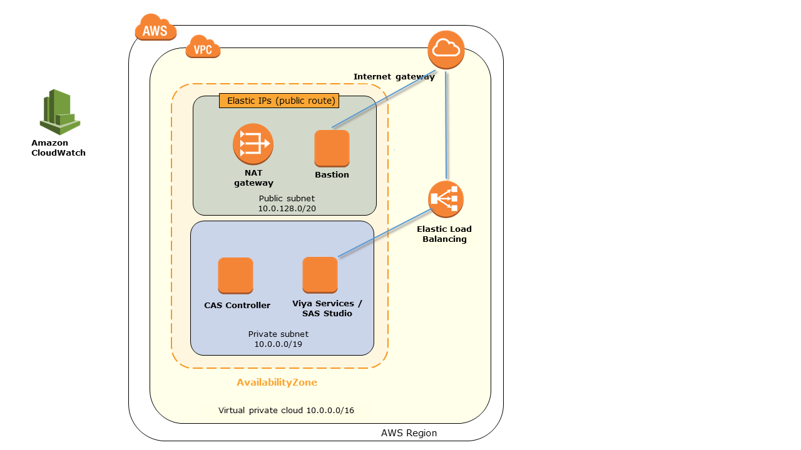

# quickstart-sas-viya

This Quick Start provides a reliable and automated way to install and configure SAS Viya Software AWS.

The Quick Start deploys SAS Viya into a AWS VPC. You can choose to deploy SAS Viya into a new or your existing AWS environment.

The Quick Start provides parameters that you can set to customize your deployment. For architectural details, best practices, step-by-step instructions, and customization options, see the deployment guide: []

## What you'll build 

Use this Quick Start to set up the following configurable environment on AWS:
   
   - A virtual private cloud (VPC) configured with public and private subnets according to AWS best practices. This provides the network infrastructure for your SAS Viya deployment.*
   - An Internet gateway to provide access to the Internet.*
   - Managed NAT gateways to allow outbound Internet access for resources in the private subnets.*
   - In the private subnet, 2 EC2 instances for SAS Viya deployment.
   - In the public subnet, an EC2 instance used as bastion host that serves as an admin node, allowing access to the SAS Viya VMs in the private subnet.
   - Security groups for the SAS Viya VMs and the bastion host.
   - A CloudWatch LogGroup for deployment and application logs.
   - Optionally, a SNS Email Notification for SAS Viya deployment start and completion messages. 
   - Your choice to create a new VPC or deploy into your existing VPC on AWS. The template that deploys the Quick Start into an existing VPC skips the components marked by asterisks above.
   
   For details, see the Quick Start deployment guide.
   
## Deployment details

Deploy the infrastructure for SAS Viya on AWS in about 50 minutes, by following a few simple steps:

1. Obtain a SAS license ***LINK?***
2. Sign up for an [AWS account](https://aws.amazon.com)
3. [Launch the Quick Start into a new VPC]
  -or-
  [Launch the Quick Start into an existing VPC], if you already have your AWS environment set up.
4. Connect to the SAS Viya application.

During deployment, you can configure AWS infrastructure components as well sas SAS Viya settings.
For detailed deployment and configuration instructions, see the Quick Start deployment guide.

## Cost and licenses

You are responsible for the cost of the AWS services used while running this Quick Start reference deployment. There is no additional cost for using the Quick Start.

The AWS CloudFormation template for this Quick Start includes configuration parameters that you can customize. Some of these settings, such as the instance type, will affect the cost of deployment. See the pricing pages for each AWS service you will be using for cost estimates.

